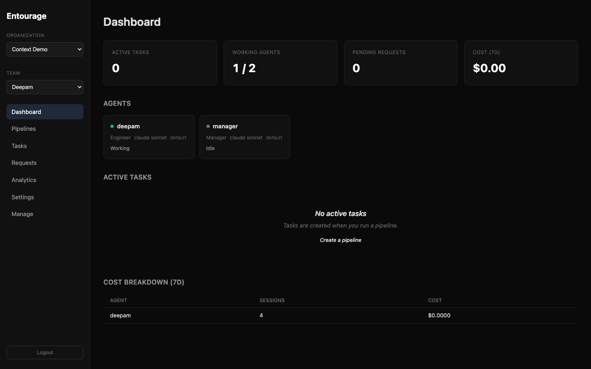
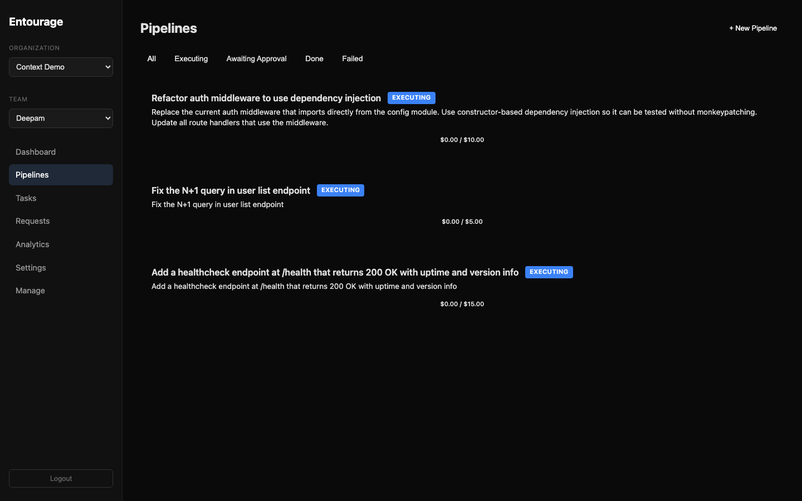
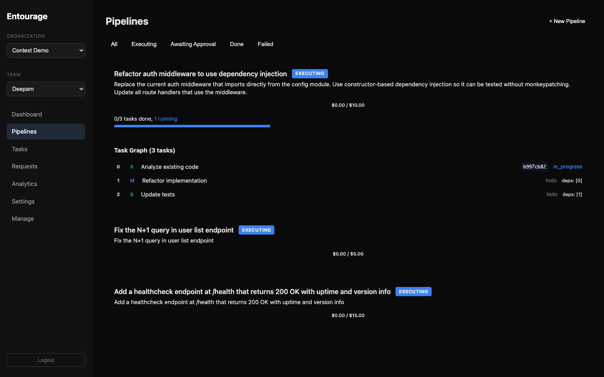
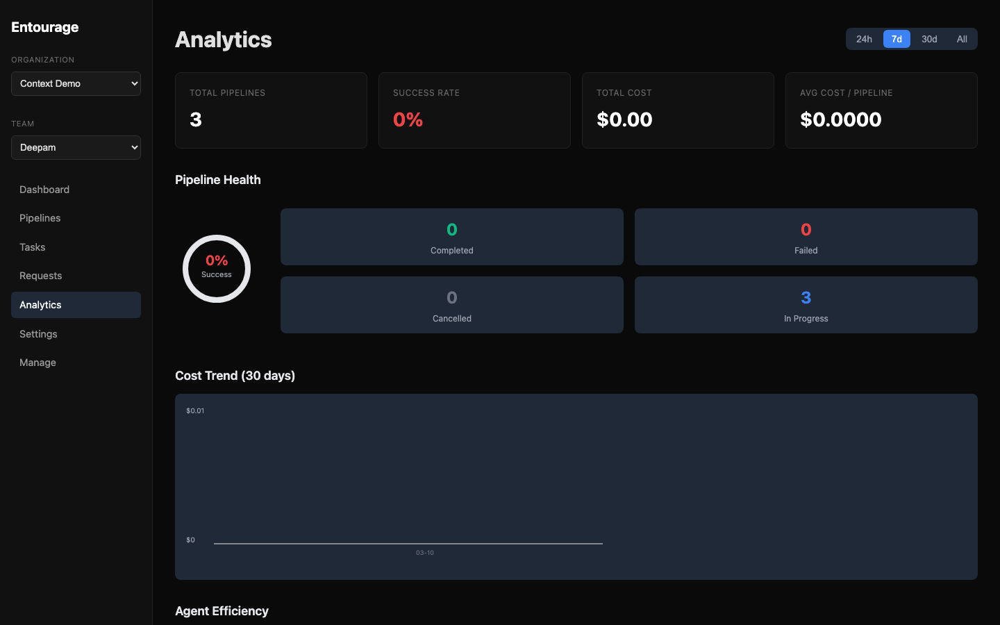
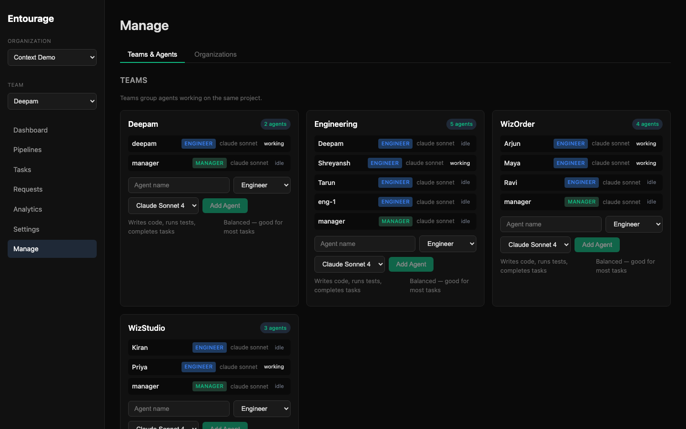

<p align="center">
  
</p>

<p align="center">
  <strong>Ship code with AI teams, not AI chat.</strong>
  <br />
  One command turns intent into planned, executed, reviewed, and merged code — with budget controls, human checkpoints, and full audit trails.
  <br /><br />
  <a href="https://modelcontextprotocol.io">MCP-native</a> · Event-sourced · Human-in-the-loop
</p>

<p align="center">
  
  
  
  
  
  
</p>

---

## The 30-second pitch

```bash
entourage run "Add rate limiting middleware to all API routes"
```

That single command:
1. **Plans** — the manager agent reads your codebase, understands the architecture, and decomposes intent into a dependency DAG
2. **Dispatches** — multiple agents work in parallel, each in an isolated git worktree and tmux session
3. **Observes** — watch any agent live with `tmux attach -t eo-task-42`
4. **Pauses** when agents hit ambiguity — they ask you, not guess
5. **Reviews** code with file-anchored comments and approve/reject verdicts
6. **Merges** via a managed queue with squash/rebase strategies

Every step is event-sourced. Every dollar is tracked. Nothing ships without your approval.

## Why not just use Claude / Codex directly?

You should. Entourage doesn't replace your coding agent — it gives it an engineering org to work inside.

| | Solo agent | With Entourage |
|:--|:-----------|:---------------|
| **Work intake** | Copy-paste into chat | `run "intent"` → task graph → execution |
| **Coordination** | One agent, one thread | Multiple agents in parallel tmux sessions |
| **Observation** | Read the output when done | `tmux attach -t eo-task-42` — watch live |
| **Memory** | Context window only | Persistent tasks, events, sessions — survives restarts |
| **Planning** | You decompose the work | Manager agent reads codebase, creates task DAG |
| **Safety** | Hope for the best | Budget caps, state machine, human checkpoints |
| **Review** | Read the chat output | File-anchored comments, approve/reject/request-changes |
| **Ambiguity** | Agent guesses | Agent calls `ask_human` and waits for your answer |
| **Isolation** | Shared workspace | Branch-per-task git worktrees — agents can't stomp each other |
| **Crash recovery** | Start over | Tmux sessions persist, stale agents auto-reset on startup |
| **Cost** | Check the Anthropic dashboard | Per-session, per-task, per-team tracking with daily caps |

## Screenshots

<table>
<tr>
<td width="50%">
<strong>Dashboard</strong> — Active tasks, agent status, cost tracking
<br /><br />

</td>
<td width="50%">
<strong>Runs</strong> — Create, plan, approve, and monitor execution
<br /><br />

</td>
</tr>
<tr>
<td width="50%">
<strong>Task Graph</strong> — Dependency DAG with complexity ratings and live status
<br /><br />

</td>
<td width="50%">
<strong>Analytics</strong> — Run health, cost trends, agent efficiency
<br /><br />

</td>
</tr>
<tr>
<td colspan="2">
<strong>Teams & Agents</strong> — Multi-team management with role badges, model selection, and live status
<br /><br />

</td>
</tr>
</table>

## How it works

```
You say "Add rate limiting"
         │
         ▼
┌─────────────────┐     ┌──────────────────┐     ┌────────────────┐
│  Run CLI        │────▶│  Manager Agent   │────▶│  Execution     │
│  entourage run  │     │  reads codebase  │     │  Loop          │
└─────────────────┘     │  creates DAG     │     └───────┬────────┘
                        └──────────────────┘             │
                              ┌───────────────────────────┼────────────────┐
                              │                           │                │
                              ▼                           ▼                ▼
                     ┌────────────────┐         ┌────────────────┐  ┌──────────┐
                     │  tmux: eo-365  │         │  tmux: eo-366  │  │  eo-367  │
                     │  Agent 1       │         │  Agent 2       │  │  Agent 3 │
                     │  worktree: A   │         │  worktree: B   │  │  wt: C   │
                     └───────┬────────┘         └───────┬────────┘  └────┬─────┘
                             │                          │                │
                             ▼                          ▼                ▼
                     ┌──────────────────────────────────────────────────────────┐
                     │  59 MCP Tools — tasks, git, reviews, sessions, budgets  │
                     ├──────────────────────────────────────────────────────────┤
                     │  FastAPI Backend — PostgreSQL + Redis + Event Store      │
                     └──────────────────────────────────────────────────────────┘
```

Agents run in **tmux sessions** for live observation and crash survival. They connect via [MCP](https://modelcontextprotocol.io) (Model Context Protocol). The backend manages all state. Humans stay in control through the dashboard, CLI, or API.

## Quick start

```bash
# 1. Infrastructure
docker compose up -d              # Postgres 16 + Redis 7

# 2. Backend
cd packages/backend
uv sync && uv run alembic upgrade head
uv run uvicorn openclaw.main:app --reload

# 3. MCP server
cd packages/mcp-server
npm install && npm run build

# 4. Frontend dashboard
cd packages/frontend
npm install && npm run dev        # http://localhost:5173

# 5. Ship something
cd packages/backend
uv run entourage login
uv run entourage run "Add a healthcheck endpoint at /health"
```

> **Prerequisites:** Docker Desktop, Python 3.12+ with [uv](https://docs.astral.sh/uv/), Node.js 18+
>
> **No Anthropic API key?** No problem. The planner falls back to built-in templates (feature, bugfix, refactor, migration) so the full platform works without any AI provider configured.

## Core capabilities

<table>
<tr>
<td width="50%">

**Run-driven execution**
- Intent → manager agent reads codebase → task DAG → parallel execution → review → merge
- Manager agent IS the planner — reads your code, understands patterns, creates smart plans
- Template fallback when no AI provider is configured
- `entourage run` one-liner or step-by-step control

**Tmux runtime (Phase 3)**
- Each agent runs in its own tmux session (`eo-task-{id}`)
- Live observation: `tmux attach -t eo-task-42`
- Crash-survivable: tmux persists if backend dies
- Atomic agent acquisition: no double-dispatch race conditions
- Event-driven dispatch: next task starts instantly when predecessor finishes

**Governed task workflow**
- 10-state machine with enforced transitions
- DAG dependencies — Task B blocks until Task A completes
- Full event-sourced audit trail for every action
- Auto-recovery on startup: stale sessions, orphaned tasks, stuck agents

**Cost controls**
- Per-session token and dollar tracking
- Daily and per-task budget caps
- Kill a runaway agent before it burns your API credits

</td>
<td width="50%">

**Human oversight**
- Agents pause and ask before risky decisions
- File-anchored review comments (not just "LGTM")
- Approve / reject / request-changes verdicts

**Multi-agent teams**
- Org → team → agent hierarchy with role-based access
- Manager agents read codebase and delegate to engineers
- Parallel execution with git worktree isolation per task
- Sibling context: parallel agents know what others are doing
- Atomic acquisition: `FOR UPDATE SKIP LOCKED` prevents double-dispatch

**Production integrations**
- GitHub webhooks auto-create tasks from issues/PRs
- JWT + API key auth with org-scoped access
- Real-time dashboard via WebSocket + Redis pub/sub
- Activity detector + reaction engine for stuck agent recovery
- 3 agent adapters: Claude Code, Codex (deprecated), Aider

</td>
</tr>
</table>

## CLI

```bash
# Run lifecycle (the main workflow)
entourage run INTENT                 # One-liner: create → plan → approve → execute
entourage run list                   # List all runs for the current team
entourage run create INTENT          # Create a new run (--template, --budget)
entourage run status ID              # Show run status, tasks, and progress
entourage run plan ID                # Start AI/template planning for a run
entourage run approve ID             # Approve the plan and start execution
entourage run tasks ID               # Show task graph with dependencies

# Quick dispatch (single agent, no planning)
entourage dispatch PROMPT            # Create task → assign → run agent directly

# Team & agent management
entourage status                     # Team overview (agents, tasks, requests)
entourage agents                     # List agents and their current state
entourage tasks [--status STATUS]    # List tasks with optional filter
entourage adapters                   # Show available adapters + readiness
entourage respond REQUEST_ID MSG     # Respond to a human-in-the-loop request
entourage login [--api-key KEY]      # Authenticate (JWT or API key)
entourage logout                     # Remove stored credentials
```

## MCP tools

59 tools across 14 categories. Agents discover and call these via the [Model Context Protocol](https://modelcontextprotocol.io).

| Category | Tools | # |
|----------|-------|:-:|
| **Platform** | `ping` | 1 |
| **Orgs & Teams** | `list_orgs` `create_org` `list_teams` `create_team` `get_team` | 5 |
| **Agents** | `list_agents` `create_agent` | 2 |
| **Repos** | `list_repos` `register_repo` | 2 |
| **Tasks** | `create_task` `list_tasks` `get_task` `update_task` `change_task_status` `assign_task` `get_task_events` | 7 |
| **Messages** | `send_message` `get_inbox` | 2 |
| **Git** | `create_worktree` `get_worktree` `remove_worktree` `get_task_diff` `get_changed_files` `read_file` `get_commits` | 7 |
| **Sessions** | `start_session` `record_usage` `end_session` `check_budget` `get_cost_summary` | 5 |
| **Human-in-the-loop** | `ask_human` `get_pending_requests` `respond_to_request` | 3 |
| **Reviews** | `request_review` `approve_task` `reject_task` `get_merge_status` `get_review_feedback` | 5 |
| **Auth** | `authenticate` | 1 |
| **Webhooks** | `create_webhook` `list_webhooks` `update_webhook` | 3 |
| **Settings** | `get_team_settings` `update_team_settings` `get_team_conventions` `add_team_convention` | 4 |
| **Orchestration** | `create_tasks_batch` `wait_for_task_completion` `list_team_agents` | 3 |
| **Runs** | `create_run` `get_run` `list_runs` `plan_run` `approve_run` `get_run_tasks` `set_run_task_graph` `cancel_run` `retry_run` | 9 |

## Agent adapters

Entourage dispatches work to pluggable coding agent backends:

| Adapter | CLI | Runtime | Notes |
|---------|-----|:-------:|-------|
| **Claude Code** | `claude` | tmux | Runs in tmux session with `--print` + stdout tee capture. Live observation via `tmux attach`. |
| **Codex** | `codex` | subprocess | ⚠️ Deprecated (OpenAI sunset Codex). `--full-auto --mcp-config` |
| **Aider** | `aider` | subprocess | No MCP; prompt includes curl-based API instructions |

Check adapter availability: `entourage adapters`

## Architecture

```
packages/
  backend/        Python — FastAPI + SQLAlchemy 2.0 async + Alembic
  mcp-server/     TypeScript — 58 MCP tool definitions
  frontend/       React 19 + Vite 6 + TanStack Query
```

15 database models, 9 Alembic migrations, 13 API routers, event sourcing throughout.

**Key patterns:**
- **Tmux runtime** — Agents run in tmux sessions for observation, crash survival, and stdout capture via `tee`
- **Atomic agent acquisition** — `UPDATE ... WHERE status='idle' FOR UPDATE SKIP LOCKED` prevents double-dispatch
- **Event-driven dispatch** — `asyncio.Event` wakeup on task completion (no polling delay)
- **Manager-as-planner** — Manager agent reads the codebase via Claude Code, then creates the task DAG
- **Constructor injection** — `ExecutionLoop`, `AgentRunner`, and `PlannerService` accept `session_factory` for testability
- **Hybrid planning** — Agent analysis → API structured conversion → template fallback (always works)
- **Lazy client init** — External API clients created on first use, not at import time

## Tests

```bash
cd packages/backend
uv run pytest tests/ -v          # 435+ tests, ~30s
uv run pytest tests/ --run-e2e   # Include live agent E2E tests
```

Per-test savepoint rollback — fully isolated, no cleanup, runs against real Postgres.

Key test suites:
- **`test_parallel_dispatch`** — Worktree isolation, atomic agent acquire, event-driven wakeup, diamond DAG dependencies
- **`test_tmux_runtime`** — Session lifecycle, IO, env vars, long messages, dead session cleanup
- **`test_activity_detector`** — JSONL session parsing, stuck/idle/active state detection
- **`test_reaction_engine`** — Automated stuck detection, global pause, rate limit handling
- Full lifecycle integration test: task creation → assignment → human-in-the-loop → code review → approval → merge → done

## Documentation

| Guide | What you'll learn |
|-------|-------------------|
| [Getting Started](docs/guides/getting-started.md) | Zero to a working AI team in 5 minutes |
| [Daily Workflow](docs/guides/daily-workflow.md) | What a typical day looks like with governed agents |
| [Multi-Agent Teams](docs/guides/multi-agent-team.md) | Manager + engineers coordinating on complex features |
| [Cost Control](docs/guides/cost-control.md) | Budget caps, per-task tracking, preventing runaway spend |
| [Webhook Automation](docs/guides/webhook-automation.md) | GitHub issues auto-create tasks for your agents |

| Reference | What's inside |
|-----------|--------------|
| [Architecture](docs/architecture.md) | System design, data flow, DI patterns, planner service |
| [Database Schema](docs/database.md) | 15 tables, relationships, migrations |
| [Task State Machine](docs/tasks.md) | Transitions, DAG, review flow, event types |
| [MCP Tools Reference](docs/mcp-tools.md) | All 58 tools with parameters and examples |
| [Development Guide](docs/development.md) | Setup, testing, patterns, project structure |

## Examples

Runnable scripts — each handles auth automatically (registers a fresh user per run):

```bash
python examples/quickstart.py           # Full lifecycle in 30 seconds
python examples/multi_agent.py          # Batch task DAG + two agents coordinating
python examples/human_in_the_loop.py    # Agent pauses, asks human, continues
python examples/code_review_flow.py     # Review → comments → approve → merge
python examples/webhook_automation.py   # GitHub webhook + HMAC verification
python examples/batch_orchestration.py  # DAG decomposition + 4 specialist agents
```

## Roadmap

| Phase | What | Status |
|:-----:|------|:------:|
| 0-4 | Foundation: MCP, orgs, tasks, git, sessions, cost tracking | ✅ |
| 5-8 | Core: real-time dashboard, dispatch, human-in-the-loop, code review | ✅ |
| 9-12 | Production: auth, webhooks, CLI, agent adapters (Claude Code, Codex, Aider) | ✅ |
| 13-17 | Polish: merge worker, multi-agent orchestration, E2E tests, full docs | ✅ |
| 18-19 | Architecture: UX overhaul, DI refactor, run CLI, template planner | ✅ |
| 20 | **Phase 3: Tmux runtime, atomic dispatch, event-driven wakeup** | ✅ |
| 21 | **Manager-as-planner: agent reads codebase, creates task DAG** | ✅ |
| 22 | **Services: activity detector, reaction engine, crash recovery, review dedup, sibling context** | ✅ |
| 23 | Project config (`ENTOURAGE.md` in-repo workflow policy) | 🔜 |
| 24 | Issue tracker integration (Linear, GitHub Issues deep sync) | 🔜 |
| 25 | Proof-of-work validation (CI status, test results before review) | 🔜 |
| 26 | Agent-to-agent review (reviewer agent auto-reviews before human) | 🔜 |
| 27 | Multi-repo runs (one intent spans backend + frontend repos) | 🔜 |

## License

MIT
